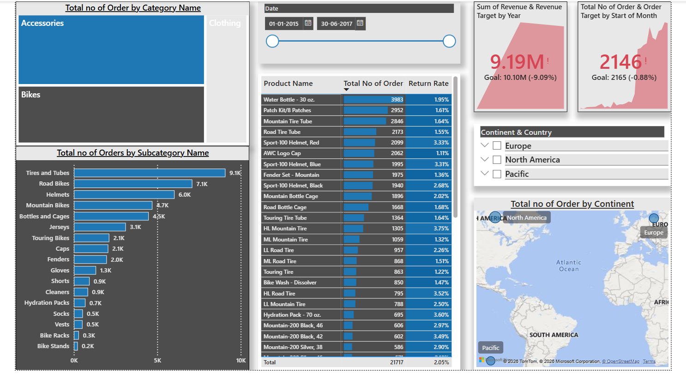
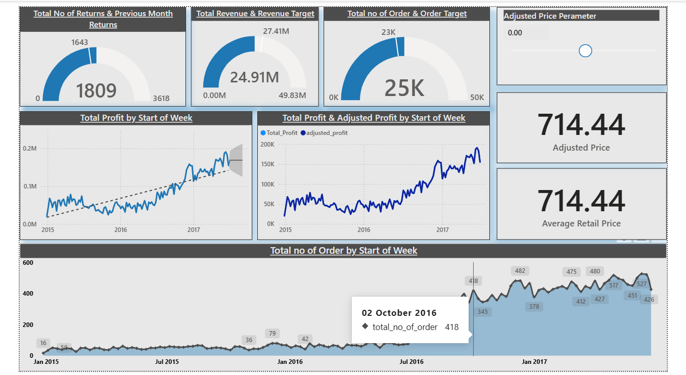
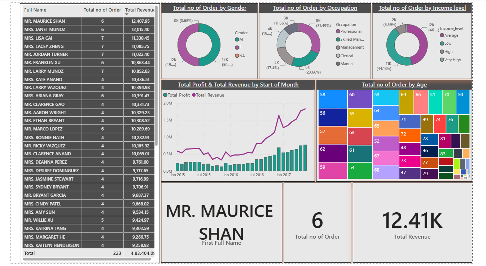

# 📊 Adventure Works Sales Analysis Dashboard

## 📌 Project Overview

This project is an **interactive Power BI dashboard** created using the Adventure Works dataset. The dashboard analyzes sales performance, customer behavior, product performance, and business trends to generate meaningful insights and support data-driven decision-making.

The project demonstrates my ability to **clean, transform, model, analyze, and visualize data using Microsoft Power BI**.

---

## 🎯 Project Objectives

* Analyze overall sales and business performance
* Track important KPIs and sales trends
* Identify top-performing products and categories
* Analyze customer and regional performance
* Understand sales patterns over time
* Create an interactive and user-friendly dashboard
* Generate actionable business insights from raw data

---

## 🛠️ Tools & Technologies

* **Microsoft Power BI**
* **Power Query** – Data Cleaning & Transformation
* **DAX** – Calculated Columns & Measures
* **Data Modeling** – Relationships between tables
* **Data Visualization** – Interactive charts, cards, slicers and graphs

---

## 📂 Dataset

The project is based on the **Adventure Works** business dataset containing information related to:

* 🛒 Sales
* 👥 Customers
* 📦 Products
* 🌎 Geography
* 📅 Dates
* 🏷️ Product Categories and Subcategories

---

## 🔄 Project Workflow

### 1️⃣ Data Loading

Imported the Adventure Works dataset into Power BI.

### 2️⃣ Data Cleaning & Transformation

Used **Power Query** to:

* Remove unnecessary data
* Handle missing values
* Correct data types
* Rename columns
* Transform and prepare data for analysis

### 3️⃣ Data Modeling

Created relationships between relevant tables and developed a structured data model for analysis.

### 4️⃣ DAX Calculations

Created calculated measures and columns to calculate important business metrics and KPIs.

### 5️⃣ Dashboard Development

Designed an interactive dashboard using:

* KPI Cards
* Bar & Column Charts
* Line Charts
* Slicers
* Tables
* Interactive filters
* Data visualizations

---

## 📈 Key Analysis

The dashboard provides insights into:

* Total Sales
* Sales Trends
* Product Performance
* Category & Subcategory Performance
* Customer Analysis
* Regional Performance
* Time-based Sales Analysis
* Overall Business Performance

---

## 💡 Key Insights

The dashboard helps identify:

* Best-performing products and categories
* Sales trends across different time periods
* High-performing regions
* Customer purchasing patterns
* Areas with strong and weak sales performance

## 📸 Dashboard Preview

### Summary Dashboard

### Product Analysis

### Customer Analysis

